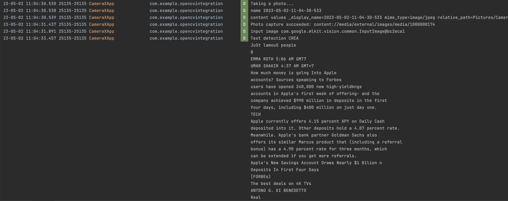
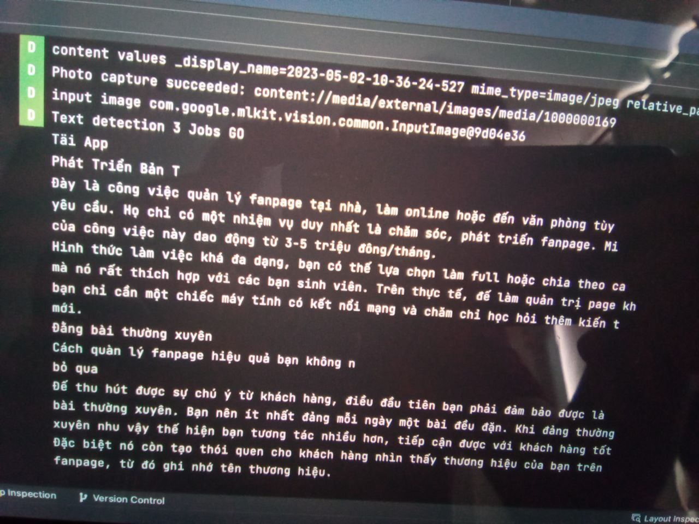
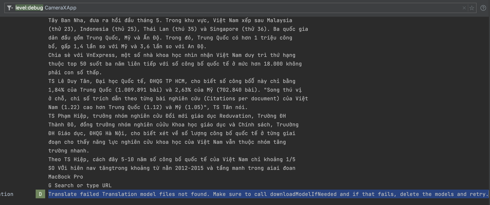
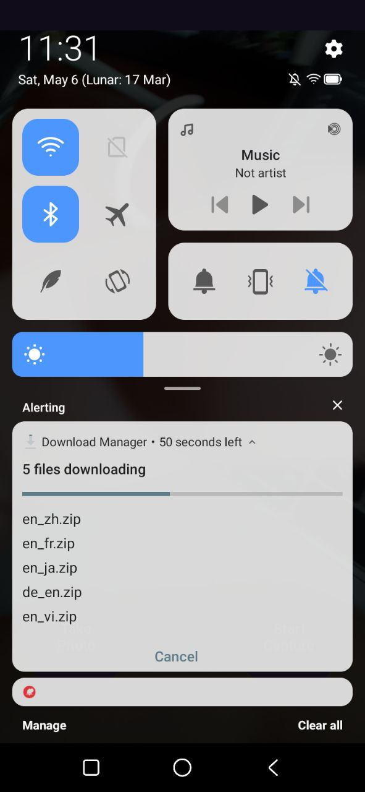

### Project Status: WORK-IN-PROGRESS, NOT Production-ready

### Project description
- Sample Android OCR, text translation, image OpenCV handling
- Support offline mode
- Offline model management
- Translation model download on background after install
- [OpenCV] Edge detection in realtime
- [OpenCV] Warp Perspective

### Comming up features
- CameraX LiveCamera OCR detection
- OpenCV image processing in realtime
- Text processing
- App cache too big resolve: fix model amount base on deletion predict implement

### Some problems need to be resolved
- App size cache too big after download (5 model will cost ~400MB in cache, 3 model will cost ~300MB), mostly for translation model download
- File structure is not good enough
- Still very simple approach on MLKit, Computer Vision, NLP

### Project author
Tran Sy Bao - Johnathan

### Demo
English detection

Vietnamese detection

Support fixed model download on background, if not => throwing error

Model download after app installed

OpenCV + Android processing

